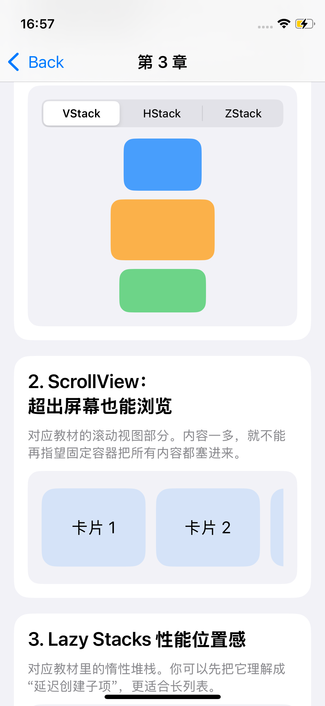
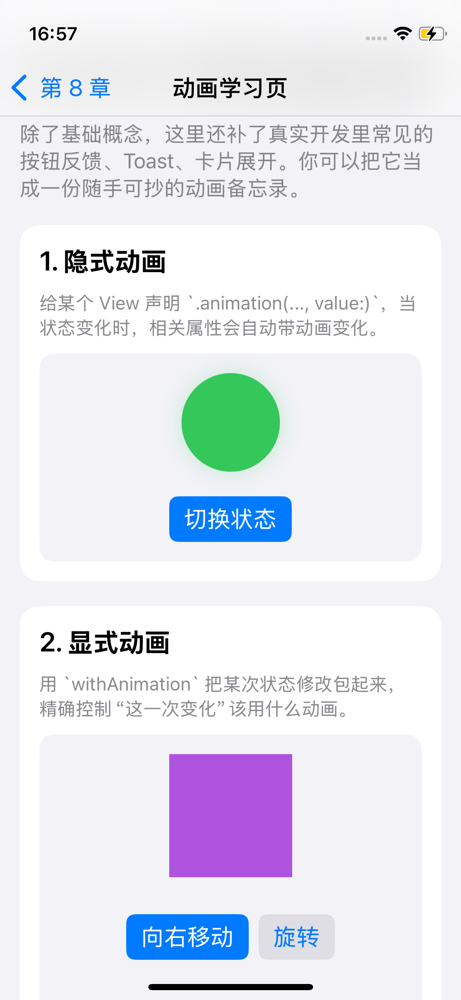
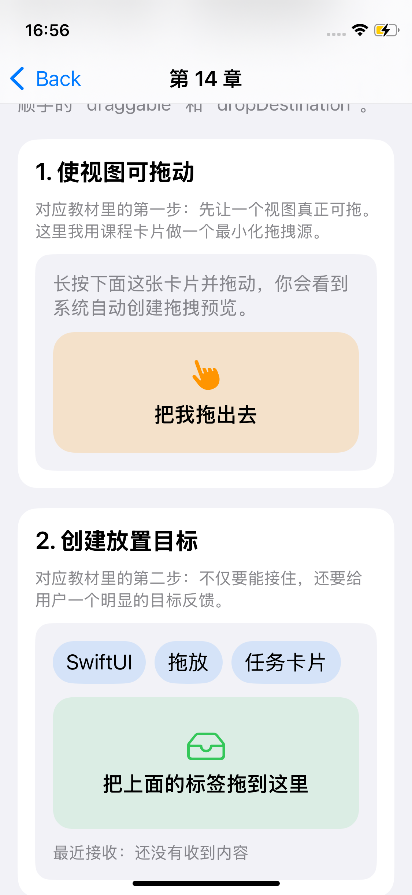
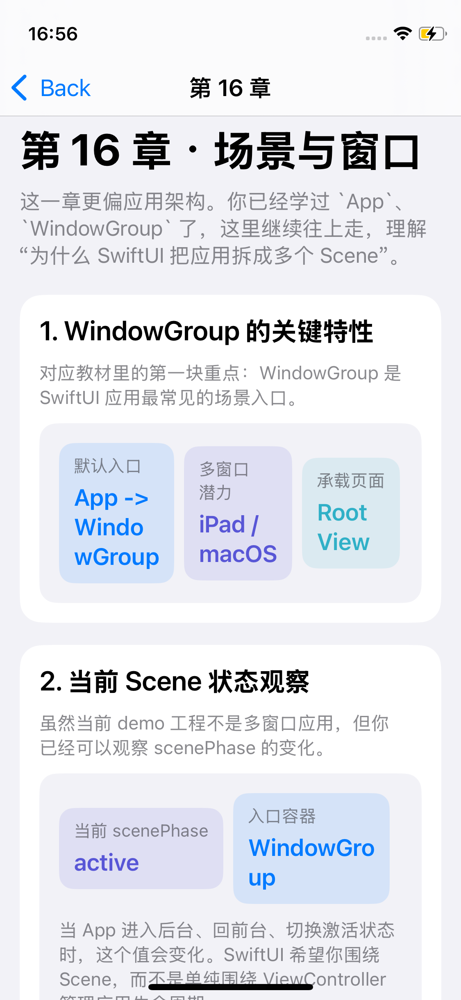
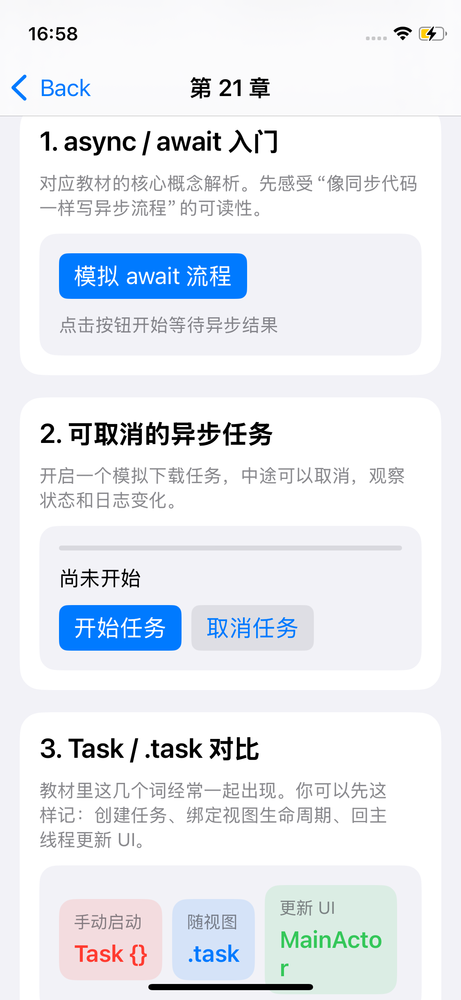

# ios-swift

一个面向 `SwiftUI` 学习与示例沉淀的 iOS 开源项目。

它不是单一功能 Demo，而是一套持续演进的学习型工程，包含：

- `SwiftUI 1-30 章` 课程式学习页面
- 动画、Path / Shape、列表、表单等专题学习 Demo
- 音视频采集、录制、回放、硬解码播放等进阶示例

整个项目强调三件事：

1. `能运行`：每一章尽量都有可交互、可观察状态变化的页面
2. `能学习`：注释、中文说明、重点提示、注意事项尽量直接写进工程
3. `能扩展`：目录结构清晰，适合继续沉淀成长期维护的开源仓库

## 项目亮点

- `30 章课程式组织`：按章节顺序浏览，适合边看教材边对照工程
- `卡片化学习页面`：一章不只一个孤立 View，而是拆成多个小实验卡片
- `中文学习友好`：说明、提示、总结都尽量直接展示在页面里
- `专题补充`：在教材原始内容之外，额外补了真实开发更常见的 Demo
- `工程结构可维护`：已按 `App / Features / Resources` 做归类，适合开源展示

## Demo 预览

### 课程章节

| 布局与容器 | 动画基础 |
| --- | --- |
|  |  |

| 拖放操作 | 场景与窗口 |
| --- | --- |
|  |  |

| 并发与异步 |
| --- |
|  |

### 当前覆盖的学习方向

- `基础篇`：视图、布局、状态、数据流、列表、表单、动画、绘图
- `进阶篇`：修饰符、组合复用、手势、拖放、系统集成、生命周期、网络、持久化
- `专题篇`：并发、自定义布局、视觉效果、辅助功能、测试调试、多平台适配
- `工程篇`：Widget、App Clip、性能优化、任务管理实战
- `音视频篇`：摄像头预览、录制、回放、硬解码播放

## 技术栈

- `SwiftUI`
- `AVFoundation`
- `AVKit`
- `CoreData`
- `XcodeGen`

## 目录结构

```text
ios-swift/
├── ios-swift.xcodeproj
├── ios-swift/
│   ├── App/
│   │   ├── DemoHomeView.swift
│   │   └── ios_swiftApp.swift
│   ├── Features/
│   │   ├── AudioVideo/
│   │   ├── Animation/
│   │   ├── BookCourse/
│   │   ├── Drawing/
│   │   ├── Forms/
│   │   └── Lists/
│   ├── Preview Content/
│   └── Resources/
├── docs/
│   └── screenshots/
├── project.yml
└── README.md
```

## 模块说明

### `App/`

- `ios_swiftApp.swift`：应用入口
- `DemoHomeView.swift`：首页导航，统一进入 30 章课程和专题 Demo

### `Features/BookCourse/`

- `Chapter01...Chapter30`：对应《SwiftUI 从入门到精通》1-30 章
- `SwiftUIBookCourseSupport.swift`：课程通用脚手架、卡片、提示组件

### `Features/AudioVideo/`

- 摄像头预览
- 麦克风采集
- 视频录制
- AVPlayer 回放
- 硬解码播放实验

### `Features/Animation/`

- 基础动画学习页
- 高级动画学习页

### `Features/Drawing/`

- Path / Shape 绘图学习页

### `Features/Forms/`

- 表单与输入控件学习页

### `Features/Lists/`

- 列表、详情、导航跳转学习页

## 适合谁

- 想系统学习 `SwiftUI` 的 iOS 初学者
- 从 `Objective-C / UIKit` 迁移到 SwiftUI 的开发者
- 想把“教材知识点”落成可运行工程的人
- 想找一个结构清晰、适合继续扩展的 SwiftUI 示例仓库的人

## 快速开始

直接用 Xcode 打开：

```text
/Users/bytedance/Desktop/ios-swift/ios-swift.xcodeproj
```

如果修改了目录结构或 `project.yml`，重新生成工程：

```bash
xcodegen generate
```

命令行构建：

```bash
xcodebuild -project ios-swift.xcodeproj \
  -scheme ios-swift \
  -destination 'generic/platform=iOS Simulator' \
  CODE_SIGNING_ALLOWED=NO build
```

## 运行说明

音视频专题页第一次启动会申请：

- Camera 权限
- Microphone 权限

录制文件默认写到 app 沙盒 `Documents` 目录，文件格式是 `.mov`。

## Roadmap

- 持续补齐教材原始 Demo 与章节练习
- 继续增加更贴近真实业务的 SwiftUI 示例
- 完善 Widget / App Clip 的真实 Target 版本
- 持续优化 README、截图和开源展示体验
